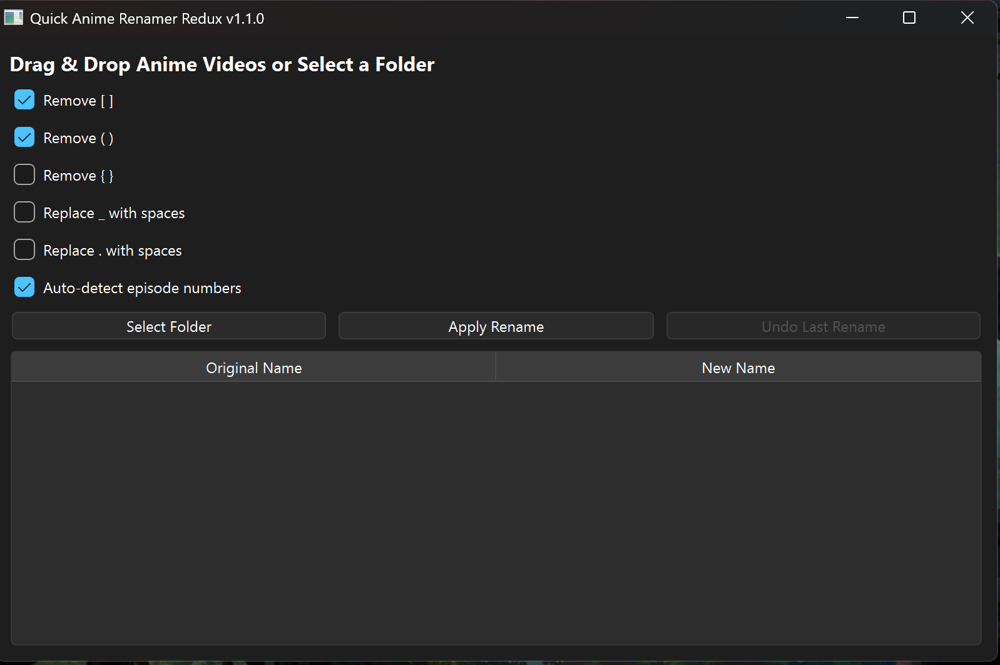

# Quick Anime Renamer Redux




A modern Windows revival of **Quick Anime Renamer**.

## Features
- Drag & drop anime videos
- Folder batch renaming
- Two-column preview
- Smart episode detection (S02E06 → S02 - 06)
- Undo last rename
- Delete key removes files from batch
- Remembers settings
- Native light/dark mode

| Original filename                              | Renamed filename                   |
| ---------------------------------------------- | ---------------------------------- |
| `[Judas] Chained Soldier - S02E06.mkv`         | **Chained Soldier - S02 - 06.mkv** |
| `Jujutsu Kaisen S01E03.mkv`                    | **Jujutsu Kaisen - S01 - 03.mkv**  |
| `[SubsPlease] Yuusha no Kuzu - 06 (1080p).mkv` | **Yuusha no Kuzu - 06.mkv**        |
| `Chainsaw.Man.Ep12.720p.mkv`                   | **Chainsaw Man - 12.mkv**          |
| `One_Piece_-_1092_[1080p].mkv`                 | **One Piece - 1092.mkv**           |
| `Spirited Away (2001).mkv`                     | **Spirited Away.mkv**              |
| `Akira.1988.1080p.mkv`                         | **Akira.mkv**                      |


## Credits
Created by **Justin Morland**  
Inspired by the original *Quick Anime Renamer* by **Joshua Park**  
Not affiliated with the original project.

## Build
Requires Python 3.10+ and PySide6.

```powershell
pip install pyside6 pyinstaller
python -m PyInstaller --onefile --windowed --icon=quick_anime_renamer_redux.ico quick_anime_renamer_redux.py
